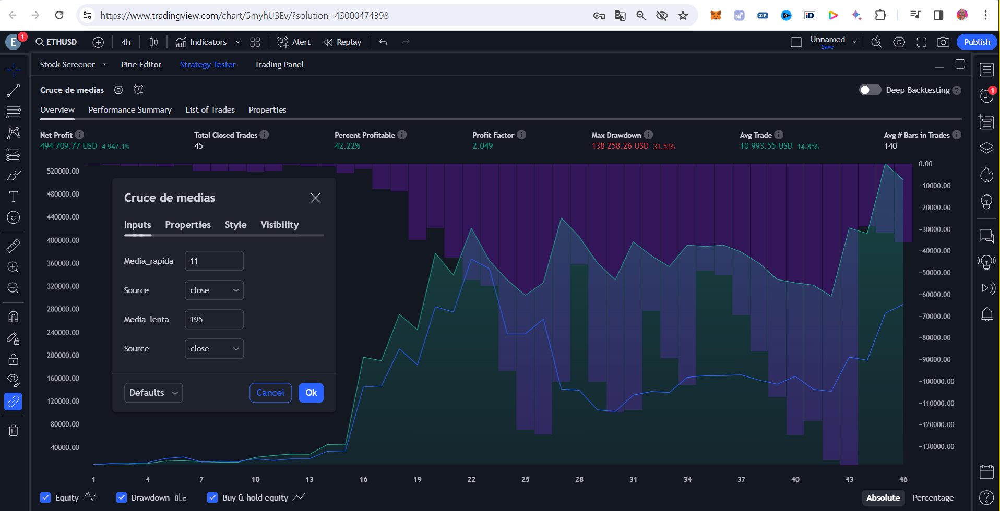
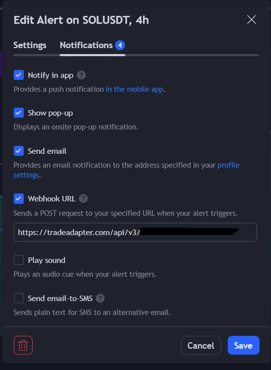

# Trading Bot with Trading View Binance and Tradeadapter

# Introducción
Para crear el Trading bot, primero crearemos una estrategia en trading view usando Chat GPT. Podemos indicar en nuestra consulta a Chat GPT que incluya los parámetros como input para después
poderlos modificar facilmente desde el testeador de estrategias de Trading View. Para poder hacer este bot hemos contratado la opción Essential por 14.95$ al mes a 26/03/2024.
La estrategia de medias cruzadas que da muy buenos resultados en la gráfica 4h con 11 de média rápida y 195 de media lenta. 


# Metodología
1. Creamos la estrategia en Trading View con la Ayuda de Chat GPT
2. Probramos la estrategia en el Strategy Tester de Trading View
3. Creamos una cuenta en Binance Future Testnet. Esta cuenta es gratuita y ofrece 15000 USD para pruebas.
4. Creamos una cuenta en tradeadapter.com . Por cuestiones de seguridad será necesario buscar otra alternativa en la implementación definitiva. En tradeadapter.com se envían las claves de la API de Binance sin proteger.
5. Creamos alertas en trading view para que se envién las ordenes a tradeadapter.com
6. Comprobamos que las operaciones se están realizando correctamente en Binance Future Testnet

# Configuración de tradeadapter.com
En el siguiente enlace tenemos las instrucciones para configurar la conexión entre Trading View y Binance https://tradeadapter.com/connect_tradingview_to_binance
Crearemos una alarma y enviaremos un mensaje 

El mensaje tendrá el siguiente formato
```
{
      "binance_api_key": "PUT YOUR BINANCE API KEY HERE",
      "binance_secret": "PUT YOUR BINANCE SECRER HERE",
      "real_order":"Yes / No",
      "order_market":"Spot / Margin / Futures",
      "order_type":"Market / Limit",
      "isolated_margin": "Yes / No",
      "auto_rounding": "Yes",
      "exchange": "{{exchange}}",
      "ticker": "{{ticker}}",
      "time": "{{timenow}}",
      "order_contracts": "{{strategy.order.contracts}}",
      "order_action": "{{strategy.order.action}}",
      "order_price": "{{strategy.order.price}}"
  }
```
  
# Links
## Tradeadapter
https://tradeadapter.com/

## Testnet Binance Future
https://testnet.binancefuture.com/

## Trading View
https://www.tradingview.com/

## Trading ALGORÍTMICO: Cómo crear una estrategia ganadora de trading con TradingView
https://www.youtube.com/watch?v=orSfLwMa4E0
