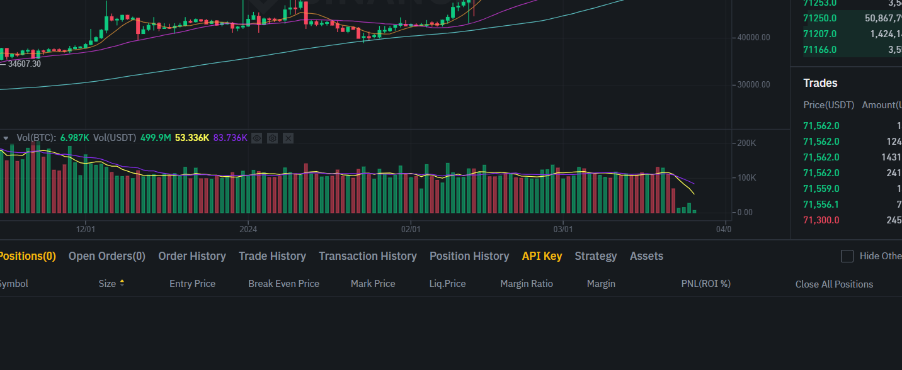
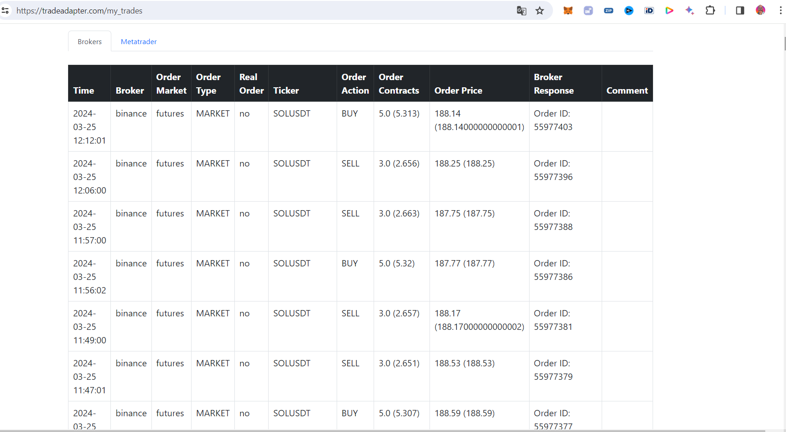
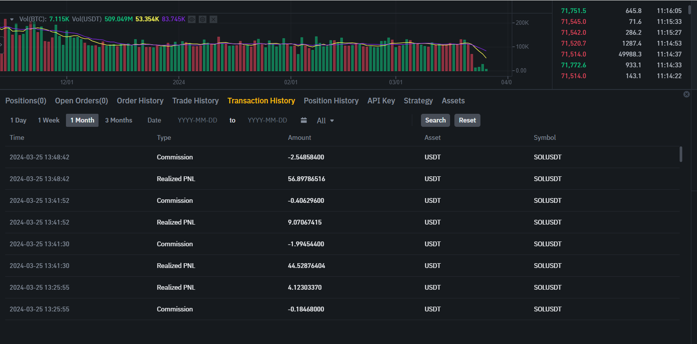

# Trading Bot with Trading View Binance and Tradeadapter

# Introducción
Para crear el Trading bot, primero crearemos una estrategia en trading view usando Chat GPT. Podemos indicar en nuestra consulta a Chat GPT que incluya los parámetros como input para después
poderlos modificar facilmente desde el testeador de estrategias de Trading View. Para poder hacer este bot hemos contratado la opción Essential por 14.95$ al mes a 26/03/2024.
La estrategia de medias cruzadas que da muy buenos resultados en la gráfica 4h con 11 de média rápida y 195 de media lenta. 


# Metodología
1. Creamos la estrategia en Trading View con la Ayuda de Chat GPT
2. Probramos la estrategia en el Strategy Tester de Trading View
3. Creamos una cuenta en Binance Future Testnet. Esta cuenta es gratuita y ofrece 15000 USD para pruebas.
4. Creamos una cuenta en tradeadapter.com . Por cuestiones de seguridad será necesario buscar otra alternativa en la implementación definitiva. En tradeadapter.com se envían las claves de la API de Binance sin proteger.
5. Creamos alertas en trading view para que se envién las ordenes a tradeadapter.com
6. Comprobamos que las operaciones se están realizando correctamente en Binance Future Testnet

# Configuración de tradeadapter.com
En el siguiente enlace tenemos las instrucciones para configurar la conexión entre Trading View y Binance https://tradeadapter.com/connect_tradingview_to_binance
Crearemos una alarma y enviaremos un mensaje 

El mensaje tendrá el siguiente formato
```
{
      "binance_api_key": "PUT YOUR BINANCE API KEY HERE",
      "binance_secret": "PUT YOUR BINANCE SECRER HERE",
      "real_order":"Yes / No",
      "order_market":"Spot / Margin / Futures",
      "order_type":"Market / Limit",
      "isolated_margin": "Yes / No",
      "auto_rounding": "Yes",
      "exchange": "{{exchange}}",
      "ticker": "{{ticker}}",
      "time": "{{timenow}}",
      "order_contracts": "{{strategy.order.contracts}}",
      "order_action": "{{strategy.order.action}}",
      "order_price": "{{strategy.order.price}}"
  }
```
Obtendremos las API KEYs de la web de Binance Future Testnet  

Configuramos el mensaje de la Alerta de Trading View que conectará con tradeadapter.com y desde este a Binance Future Testnet. De esta forma tendremos funcionando nuestro Trading Bot que podremos probar antes de pasar a Binance con operaciones reales.

Siguiendo las indicaciones del vídeo Trading ALGORÍTMICO: Cómo crear una estrategia ganadora de trading con TradingView, debemos introducir en nuestro script Stop Loss de diferentes tipos. Por ejemplo podemos introducir un Stop Loss si la rentabilidad de nuestro algoritmo no alcanza un determinado valor. En definitiva debemos introducir elementos que nos permitan parar el Trading Bot si, por cualquier circunstancia, deja de funcionar correctamente.

Es importante también, solicitar a Chat GPT que introduzca los parámetros como inputs, y que introduzca stop loss en nuestras operaciones. Es importante también, no olvidar introducir los valores de las comisiones ya que este valor puede hacer que una estrategia deje de ser rentable.

Para acelerar las pruebas hemos tomado la temporización en Trading View de 1 minuto, sin embargo no he encontrado ninguna estrategia rentable con este tiempo tan corto.

# Conclusiones

La creación de este primer Trading Bot ha sido sorprendentemente sencilla con la ayuda de un amigo experto en trading y con Chat GPT. En los casos que ha fallado, introduciendo el error que mostraba Trading View ha sido capaz de corregir el fallo en el 100% de las ocasiones. El procedimiento de conexión con tradeadapter.com ha sido sencillo. Hemos tenido que registrarnos para poder realizar las operaciones y después de 7 días de pruebas, tendremos que pagar la suscripción si queremos seguir utilizando el servicio de tradeadapter.com. Desde el punto de vista de la seguridad, tradeadapter.como no aporta muchas opciones. Para una implementación definitiva, mi recomendación sería buscar otra alternativa. Implementar un servidor que tome las peticiones POST enviadas desde las notificaciones de Trading View, o bien otra alternativa que ofrezca mayor nivel de seguridad. Te dejo algunas alternativas en el apartado Alternativas para Tradeadapter de la sección Links. Otra alternativa es crear un Web Hook directamente en Binance, para hacerlo busca mira el enlace "Binace How to set up signal trading with tradingview".

A continuación se muestra el listado de ordenes procesadas por tradeadapter.com 
   

y aquí el listado de ordenes procesadas por Binance 
   
 
# Links
## Tradeadapter
https://tradeadapter.com/

## Testnet Binance Future
https://testnet.binancefuture.com/

## Trading View
https://www.tradingview.com/

## Trading ALGORÍTMICO: Cómo crear una estrategia ganadora de trading con TradingView
https://www.youtube.com/watch?v=orSfLwMa4E0

## Binace How to set up signal trading with tradingview
https://www.binance.com/en/support/faq/how-to-set-up-signal-trading-with-tradingview-3f57291b56474f5e900cc4b754f61ff3

## A Simple Pullback Strategy
https://courses.theartoftrading.com/pages/a-simple-pullback-strategy-in-pine-script

## 1 Minute SCALPING STRATEGY Makes $100 Per Hour
https://www.youtube.com/watch?v=VOLXKXAReGI

## Alternatives to Tradeadapter
https://www.kryll.io/webhooks/
https://aleeert.com/
https://cryptorobotics.net/
https://www.growlonix.com/
https://finandy.com/es/signals
https://alertatron.com/
https://intellybot.com/
